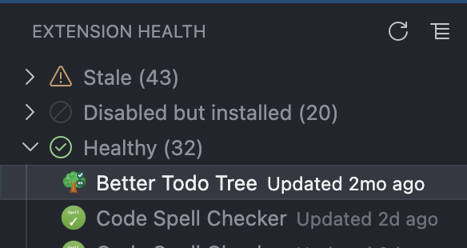
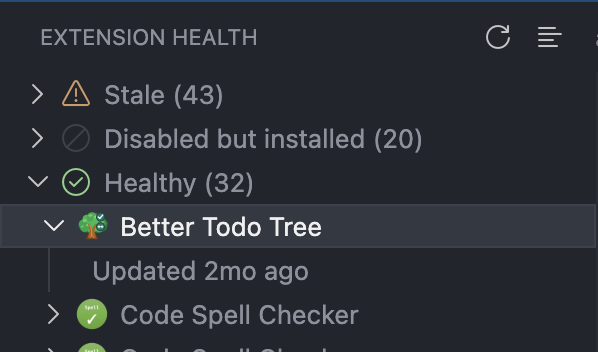

# Extension Health

Adds an "Extension Health" view to the Activity Bar that lists your installed VS Code
extensions grouped by **Deprecated**, **Stale**, **Disabled but installed**, and
**Healthy**, using Marketplace "last updated" data, deprecation flags, and (optionally)
GitHub last-commit recency.

This is a personal/community tool, not affiliated with or endorsed by Microsoft.

## Screenshots

Inline mode (details shown next to each extension name):

Dropdown mode (click an extension to expand its details as a child row):

## How it works

- **Installed extensions (including disabled ones)** are found by scanning your local
  `~/.vscode/extensions` folder directly and reading each extension's own
  `package.json`. This list is cross-referenced against `vscode.extensions.all`, which
  the VS Code API only populates with *enabled* extensions — anything on disk but
  missing from that list is treated as disabled.
- **"Last updated" / deprecated flag** come from VS Code Marketplace's internal Gallery
  query API (`.../_apis/public/gallery/extensionquery`). This endpoint is **not a
  public, documented API** — it's the same one the Extensions view itself uses
  internally, but its request/response shape could change or break at any time without
  notice.
- **GitHub last-commit date** (optional enrichment) is looked up via the public GitHub
  REST API when a repository link is available. Unauthenticated requests are limited to
  60/hour, which is easy to exhaust with a large extension list. Run the
  **Extension Health: Set GitHub Token** command to store a personal access token in
  VS Code's secret storage and raise that limit to 5000/hour. No token is required for
  the view to work — GitHub data is simply skipped once rate-limited.

## Settings

- `extensionHealth.staleMonths` — months since the last Marketplace update before an
  extension is considered stale (default `12`).
- `extensionHealth.excludedExtensions` — extension IDs to exclude from health checks.

## Known limitations

- Desktop only (uses Node `fs`/network APIs) — does not run on vscode.dev/web.
- No automated "these two extensions do the same thing" detection — that requires
  reading descriptions/READMEs and isn't reliably automatable from metadata alone.
- No programmatic enable/disable — only "Open in Marketplace" and "Uninstall" are
  offered, since there's no supported public API for toggling extensions.
- Remote development hosts (SSH/WSL/Containers) are not yet handled; only the local
  `~/.vscode/extensions` folder is scanned.
